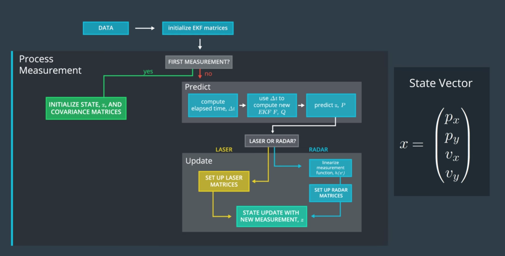
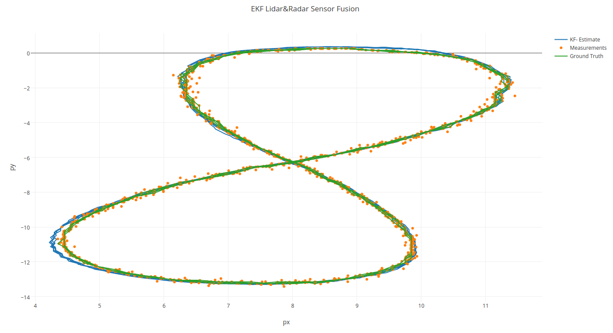
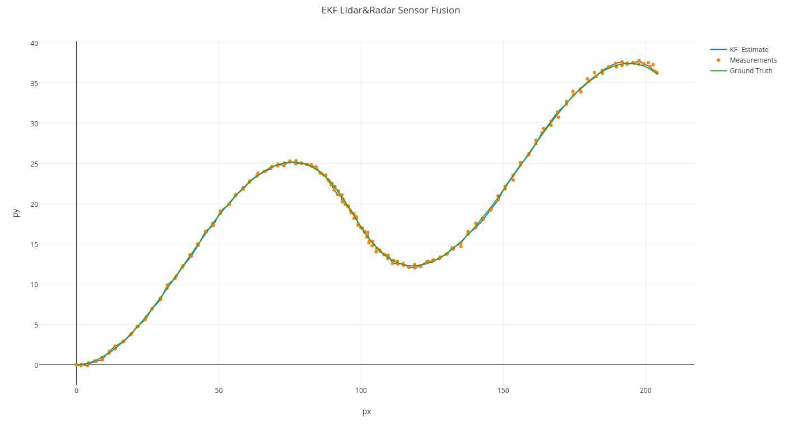

# Extended Kalman Filter
Lidar and Radar sensor fusion using Extended Kalman Filter. it was written in c ++.

## Usage
```
Input files are required

Usage: 
   ./EKF_Project path/to/input.txt output.txt
```

## Sensor Fusion General Flow
| General Flow       |
| -------------------------- |
|  | 


## Result

| Input file 1 - sample data1| RMSE                                                      |
| -------------------------- |:----------------------------------------------------------|
|   | px=0.0651649<br>py=0.0605379<br>vx=0.533212<br>vy=0.544193|

| Input file 2 - sample data2| RMSE                                                      |
| -------------------------- |:----------------------------------------------------------|
|   | px=0.185491<br>py=0.190359<br>vx=0.487648<br>vy=0.816535  |
